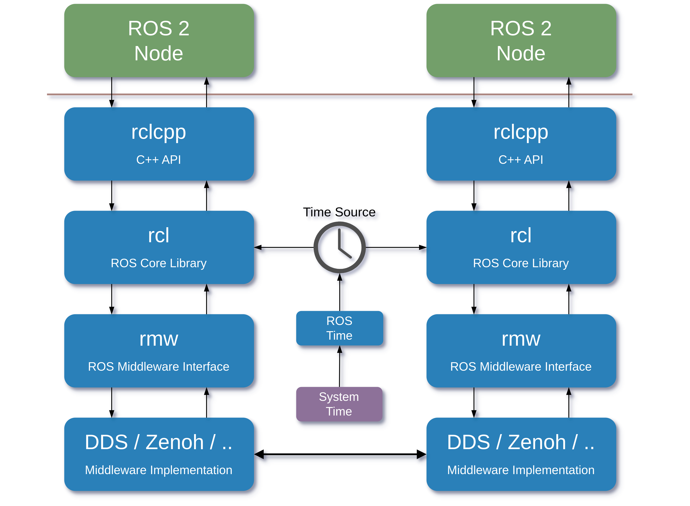
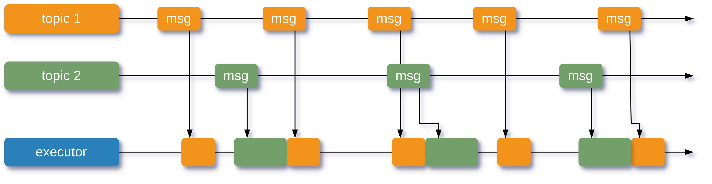
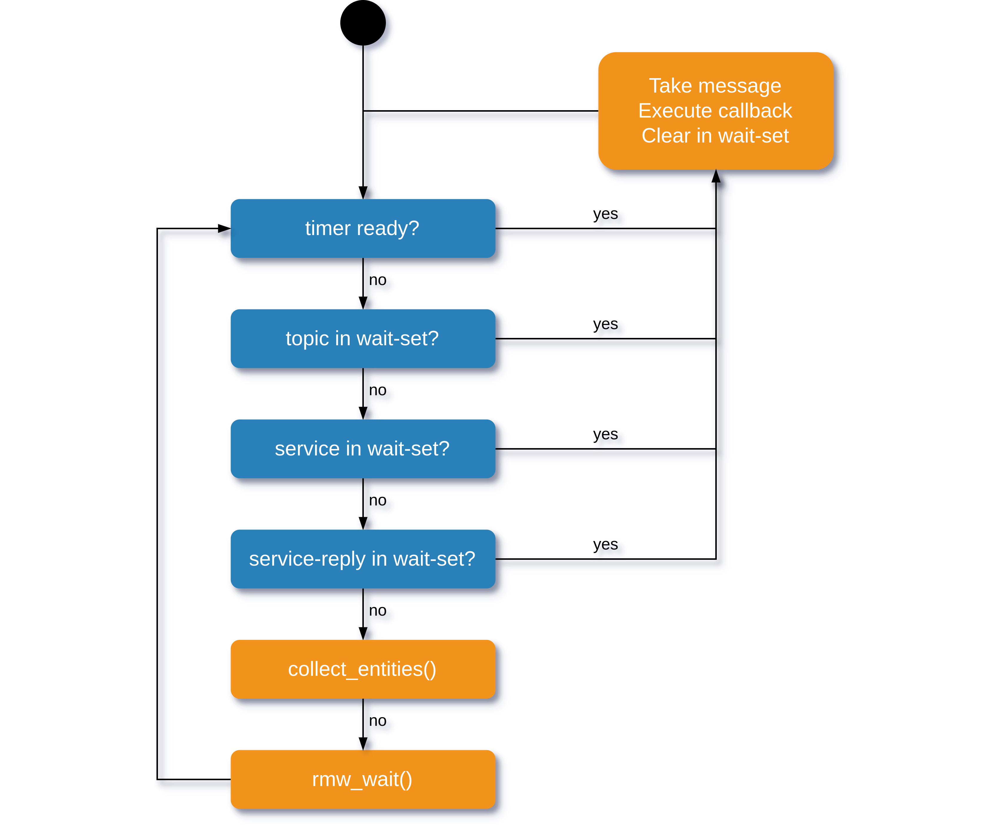
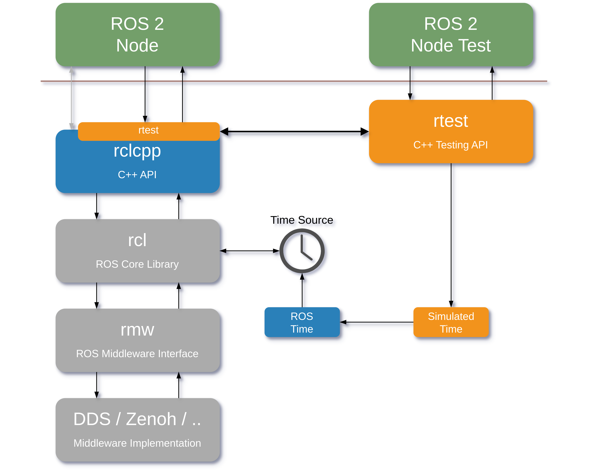

# Concepts

```{contents} Contents
---
depth: 2
local: true
---
```

## Unit Testing

Every system that aims for high quality requires unit tests. They are the foundation of a robust testing strategy, enabling developers to verify that individual components function correctly in isolation.

As Kent Beck stated in his seminal book on Test Driven Development:
> "Test-driven development is a way of managing fear during programming."

This profound insight captures the essence of why we test - to gain confidence in our code and reduce the anxiety associated with making changes.

The process of writing code and testing it follows a cyclical pattern. A programmer writes code (or test code first), tests if it functions as expected, and if not, implements fixes and repeats the process. For maximum effectiveness, this feedback loop **must be as short as possible, easy to execute, and consistently reliable**. Quick, simple, and dependable tests encourage developers to test frequently, catching issues early when they're least expensive to fix.


## The Challenge of Testing in ROS 2

When working with ROS 2, writing unit tests for Nodes that communicate through topics, services, and actions presents unique challenges. While creating basic tests may not be overly complex, developing reliable tests that consistently produce the same results across different environments and execution contexts can be extremely difficult. The asynchronous nature of ROS 2 communication, combined with its middleware complexity, introduces variability that can make tests flaky and unreliable without proper tooling and methodologies.

Let's examine the ROS 2 software stack:



As illustrated in the diagram, communication between nodes involves traversing multiple software layers with significant underlying complexity. This architectural depth creates substantial challenges when developing reliable unit tests.

When testing more sophisticated interaction scenarios, relying solely on the standard ROS 2 stack often proves insufficient. The multi-layered communication path introduces numerous potential points of failure and non-determinism that can compromise test reliability and repeatability.

The complexity of this communication chain requires specialized testing approaches that can effectively manage or bypass these layers when appropriate, providing more consistent outcomes.

### Time Management Complexity in ROS 2

In ROS 2, the timing subsystem introduces significant complexity to the testing landscape. The execution flow of nodes is fundamentally affected by time-dependent operations, such as timer callbacks and timestamped message processing.

These temporal dependencies create unpredictable behavior, as even slight variations in timing can lead to substantially different execution paths and outcomes. For example, race conditions may manifest differently across test runs, callbacks might execute in unpredictable orders, and deadline-based operations could behave inconsistently.

Consider a scenario where a Node subscribes to messages on two distinct topics with different publication rates. One topic may publish at approximately 100Hz while the other at 50Hz. However, these frequencies are rarely precise in real-world systems—they typically fluctuate within a range (e.g., between 99Hz and 101Hz).



This temporal variability introduces timing drift, resulting in inconsistent message reception patterns across different execution instances. The random arrival sequence can significantly impact node behavior, especially when logic depends on the relative timing between messages from different sources.


For robust and reproducible testing, it becomes imperative to gain precise control over the timing mechanism. By managing the temporal aspects of the system under test, we could:

1. Simulate specific timing scenarios
2. Test edge cases involving temporal sequences that rarely occur naturally
3. Verify system behavior across different timing configurations
4. Eliminate flaky tests caused by timing variability
5. Speed up test runs where the implementation relies on long running timers

Effective testing strategies must therefore incorporate mechanisms to manipulate and control the timing subsystem, allowing for consistent and predictable test execution regardless of the underlying hardware or system load.

### ROS 2 Execution Model

The ROS 2 execution model is not a singular, unified concept but rather a diverse ecosystem of implementation approaches. This diversity begins at the middleware level, with various implementations differing significantly in their threading models, event loop organization, and other architectural characteristics. Beyond the middleware, the operating system's scheduler and concurrent processes introduce additional complexity and non-determinism.

ROS 2 offers several executor implementations, each with distinct behaviors:
- `SingleThreadedExecutor`: Processes all callbacks sequentially in a single thread
- `StaticSingleThreadedExecutor`: Similar to the above but with compile-time optimization
- `MultiThreadedExecutor`: Distributes callback processing across multiple threads
- `EventsExecutor`: Event-driven approach to callback processing

Even when examining the simplest case—the single-threaded executor, we encounter important scheduling semantics. In scenarios where callback processing time is shorter than the event occurrence period, the executor processes events in a straightforward FIFO (First-In-First-Out) order. However, when callbacks require longer processing time, messages and events accumulate in queues at lower layers of the stack, introducing potential latency and priority inversions.



The execution order follows a type-based prioritization scheme. For instance, timer events are always processed before other event types, regardless of when they actually occurred. While explicit prioritization has been removed in recent versions, the order in which events are checked continues to create an implicit priority hierarchy that affects system behavior.


### ROS 2 C++ Client Library

The ROS 2 C++ Client Library (rclcpp) provides a powerful and well-designed abstraction layer for ROS 2 functionality. However, its architecture, centered around class inheritance and template nature, presents significant challenges for testing.

A core limitation stems from its factory method pattern for creating communication entities. For example, publishers and subscriptions can only be instantiated through Node factory methods:

```cpp
class MinimalPublisher : public rclcpp::Node
{
public:
  MinimalPublisher()
  : Node("minimal_publisher")
  {
    publisher_ = this->create_publisher<std_msgs::msg::String>("topic", 10);
  }

private:
  rclcpp::Publisher<std_msgs::msg::String>::SharedPtr publisher_;
};
```

This design pattern, while offering encapsulation benefits, significantly complicates dependency injection for testing. Since there's no direct way to substitute these entities with mock implementations, controlling node behavior becomes cumbersome.

Furthermore, core classes like `Subscription` and `Publisher` don't implement abstract interfaces but rather use heavily templated implementations. This approach delivers performance advantages through compile-time optimizations but creates obstacles for test instrumentation. Without clear interface boundaries, intercepting and controlling interactions between the node and the ROS middleware becomes exceedingly difficult.

These architectural decisions optimize for runtime performance but inadvertently create testing challenges that require specialized solutions to overcome.


## Testing Philosophy of Rtest

The previous sections have highlighted several significant challenges when testing ROS 2 applications:

1. **Complex Multi-layered Architecture**: ROS 2's layered communication stack introduces numerous potential points of failure and complexity.

2. **Time Management Complexity**: The timing system creates unpredictable behavior as even slight variations can lead to different execution paths.

3. **Diverse Execution Models**: Different executor implementations, threading models, and event prioritization add complexity to testing.

4. **Client Library Design Limitations**: The factory method pattern and template-heavy implementation of rclcpp complicate dependency injection and test instrumentation.

These challenges combine to make traditional testing approaches insufficient for ROS 2 applications. Tests become flaky, unreliable, and difficult to maintain, ultimately undermining developer confidence in the codebase.

Rtest was designed specifically to address these challenges. It provides a comprehensive testing framework that gives developers precise control over the ROS 2 environment, allowing them to create simple, reliable tests for even the most complex node interactions.


## Rtest design

### ROS Client Library interposition

At its core, Rtest employs an architectural approach that intercepts the communication chain between a ROS 2 Node and the Client Library. By inserting a thin interposition layer above the rclcpp API, Rtest effectively disables the underlying asynchronous mechanisms while preserving the familiar API surface.

This strategic interception provides developers with complete control over execution paths during testing. Rather than relying on the inherently uncontrolled behaviors of the full ROS 2 stack, Rtest offers precise orchestration capabilities that enable robust, reproducible test scenarios.



### Time Control

Rtest provides comprehensive control over the time delivery mechanism and timer event execution. This enables testing of time-dependent implementations with precision matching the maximum temporal resolution offered by ROS 2 systems. Developers can:

- Advance simulated time with microsecond precision
- Trigger specific timer callbacks in a controlled sequence
- Test edge cases involving precise timing scenarios 
- Verify behavior across simulated temporal patterns

### Development Tools

Rtest includes a suite of specialized testing utilities designed to enhance developer productivity:

- **Static Registry**: Verify if a Node creates expected entities—publishers, subscriptions, service clients and servers, actions, and timers
- **Publishers and Subscription Mocks**: Capture publish events and verify messages. Directly inject messages and trigger subscription callbacks in a controlled manner
- **Service Client and Service Provider Mocks**: Capture service calls, verify arguments, and provide predetermined responses. Inject service requests to servers, capture responses, and validate them
- **Timer Mocks**: Validate timer creation with expected time intervals. Trigger timer callbacks directly without waiting for actual time periods
- **Simulated Time**: Leverage ROS 2 simulated time source to control time flow with absolute precision
- **Logger Inspection Tools**: Capture and verify logging events by message content and severity level

These tools combine to create a testing experience that is both rigorous and developer-friendly, making comprehensive test coverage achievable with minimal friction and no production code changes.

Follow the [Tutorials](../Tutorials/index.md) section to see Rtest in action.

> **Note**: Rtest is under active development. Some features may be unavailable or have limited support across certain ROS 2 distributions. Refer to documentation for compatibility details.
